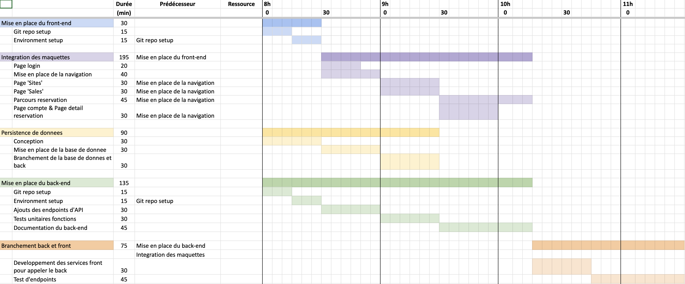

# Conception plan logiciel

## FAQ

#### Où se trouve le suivi de projet ?

Dans l'onglet projet du repository [GitHub](https://github.com/users/geo-n13/projects/1)
Doc OpenAPI [API Docs](https://documenter.getpostman.com/view/27422617/2s93eeR9Ze#3f96865f-8c02-4ef5-8a5f-38f80e31192d)

## Screenshots

## Authors

- [@geo-n13](https://www.github.com/geo-n13)
- [@annaty](https://www.github.com/annaty)
- [@ClemLCS-n13](https://www.github.com/ClemLcs)
- [@L-Clem](https://www.github.com/L-Clem)

